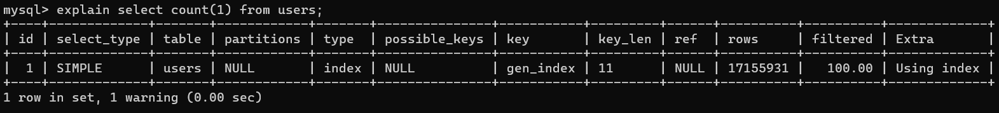

# MyMySQL

A demo for mysql.

## Init a Users table

## Insert 10Million users

## Velocity for querying
### Count
1. Without keys: the average of query in 10 times is 9 seconds
2. With PK:
### TODO
      i. 前些天(23年春吧应该是), 某同事说到他们数据库达到了千万级别, 突然我就被震惊了, 没想到我们公司居然还有这种业务, 突然就来了兴趣, 问他他们关于这些是怎么处理的, 同时自己也开始思考这种情况下有什么策略能保证系统的高性能
      ii. 思来想去, 除了分库分表(关于分库分表本人也并未实操过), 也没想到行之有效的方法. 但是如果使用分库分表的逻辑, 那业务的底层逻辑就需要适配分库分表的逻辑, 改动太大; 并且他们这些都是业务数据, 不存在热点数据一说, 所以使用缓存redis之流的也没有效果
      iii. 但是我对这种场景还是相当感兴趣的, 就通过程序在创建的一个测试表插入了大概1700万条数据, 数据都是一样的(其实当时想通过一个随机工具生成随机信息, 但是当时还没写这个随机工具), 发现如果不加索引单单count查询就得1分钟多, 加上主键索引就2.7~2.8秒, 果然索引的提升是巨大的, 但是还是存在继续优化的程度
      iv. 于是就想看看这个分库分表是不是跟我理解的一样, 对程序侵入较大
      v. 随机工具已经写好了(250303）,从昨天晚上开始通过jdbcTemplate.batchUpdate()插入数据，目标是1kw数据量，测试这个级别下mysql的查询性能
      vi. 工具执行效率1秒400条左右，全部执行完毕要近7个小时，当时也没有想优化下，想着睡醒就插完了；
      vii. 结果第二天醒来查看有大概200w的数据量，查询后台也没有发现异常中止的原因；重新插入1kw数据在这样的效率就不能接受了，想着使用多线程执行：executorService e = Executors.newFixedThreadPool(64);这样下来，每秒大概能插入2000条数据；
      viii. 结果在不久之后查看数据条数，发现停在大概400w时不动了，也就是程序又中止了；猜测是在执行过程中存在异常，但异常打印被淹没在debug中；调整日志输出，再次启动程序；
      ix. 果然在600w左右又停了，查看日志显示‘Failed to obtain JDBC connection’;查询得知，springboot jdbc使用hikari管理连接池，默认最大是10，mysql默认最大连接数是151，显然hikari限制了多线程效率；以我和程序（100线程）来说，每次启动会有100个线程尝试获取连接，其中有10个成功获取，另外90个就等待连接；在默认连接超时（hikari默认30秒）后就会抛出异常；处理就是提高连接数，或者提高超时时长；再次重新执行
        i. 
      x. 神奇的是修改之后，效率由原来1秒2k变成了1秒3w，5分钟多就能完成插入；查看后台日志无报错；从任务管理器上可以看到跟之前只有启动时CPU使用会上去一下，3~5秒钟之后就会恢复到5%左右的占用不同，现在CPU全程在50~70%之间浮动，明显这才是多线程该有的效率
      xi. 正常完成插入，库中单表users存在1.7kw数据，开始测试默认查询效率；
      xii. count查询耗时9s左右；默认是添加了主键的
        i. 
      xiii. 忽略主键，再次查询：select count(1) from users ignore index(primary); 时间仍是9秒左右；可见主键对这种全表扫描的查询没有作用
        i. 
      xiv. 那查询某一条结果，测试主键是否能够起作用：select * from users where id = 10000000; 0.01s返回结果；而忽略主键的情况下：select * from users ignore index(primary) where id = 10000000；查询结果要11s左右返回，显然索引是有明显优化能力的，也就是说维护索引是优化sql最简单最有效的手段；而其它的方式，只能根据实际业务场景分别应对
        i. 
        
        ii. 
      xv. 对10m数据进行按gender分组，分别计数：select gender, count(1) from users group by gender；此时主键索引不在生效，因为扫描表数据时不涉及id，所以查询执行了13s左右的时间；
        i. 
      xvi. 优化的话需要对gender添加索引，create index gen_index on users(gender); 在命令执行的时候我在想，这个命令下去，数据库肯定要对每条数据按照这个索引来创建一个对应的数据结构；这个场景下对应的索引结构应该就是两个有序节点，第一个节点代表男性，第二个节点代表女性，然后就分别对存储在这两个节点上的数据进行计数
        i. 
        
        ii. 
      xvii. 这里需要说下，这个索引的数据结构是由原表数据组成的，如果原数据原封不动的创建出来一个数据结构，那整体下来一个表会占好几份的空间，这样未免也太浪费资源了；所以索引对应的数据结构只是根据一个基础的排序信息（本例中就是gender:0/1）,和满足这个排序下对应节点的数据集；这个数据集一般都是满足条件数据的id，这样就可以根据这个id再去原表中获取对应的字段即可
      xviii. 想到这里我又有疑问了，那一般情况下primary都是随表创建指定的，那这种情况下是除数据外又创建了一个针对primary的索引结构么？想了想不至于，抛开primary索引结构不说，原来的那个数据，也没有存在的必要了，因为它很可能提供不了什么查询性能方面的东西，不能是存起来就不管了
      xix. 再回来说上边gender分组并计数的操作：添加索引的命令执行了44s，添加完成后执行分组计数的操作，4s
      xx. 可以理解，因为虽然把数据分组的操作很快，但还有一个计数操作；每个数据都需要维护到节点上；那这样每个节点上要挂8m的id信息，把这些信息数一遍，跟最开始的全表计数差别不大；如果只查询分组的结果，那就只需要0.02s就完成了
      xxi. 刚才说到每个节都需要挂载8m+的id信息，那这个红黑树是怎么组织节点内数据的？想了一会就放弃了，没有太大的意义，大概是一个链表吧，因为没有计数的优化，也没有必要再对红黑树进行扩展
      xxii. 还回到刚才的那个分组计数问题上来，17m数据分组计数，而且这只是最简单的分组情况，执行时间长达4s也是不能接受的情况
      xxiii. 再执行一下select count(1) from users; 结果查询时间变成了3s，奇怪，添加gender也不应该影响；删除gender，结果又变成了10s+; 添加回来，又变成了3s左右
      xxiv. ？？？explain下
        i. 
      xxv. 明白了，select count(1) from users可以从gen_index获取结果，但select count(*) from users则不能，因为gen_index上只有id和gender，不满足count(*)的条件；然后就是这个查询明明没有条件涉及索引，却能准确找到gen_index来优化执行速度（相比无索引情况下）；猜测就是在查询时mysql做了优化，即先查找条件涉及的索引，未命中则在所有索引结构中查找结构层级较少的结构，也没有命中时就只有进行全表扫描了
      xxvi. 那如果是这样，怎么来确定多少个节点对分组计数的这种情况最友好？实验下看看
      xxvii. 分别对age（18 rows），username(8 rows)添加索引，起初执行时间为3s+；添加了username index后，时间又增长回了4s+，通过explain查看前后都是使用的age_index；具体原因不确定，但可以知道的是当索引生效后，优化索引并不会引起质变，仍要通过其它途径来进行
      xxviii. 网上搜索下，列出了几点：1. 索引，2. 优化sql语句，3. 限制返回数据集条数， 4. 使用join替代子查询，5. 范式，即规范表设计，6. 是否可根据查询模式分表，或者使用总计表/物化视图来替代大数据量的聚合查询，7. 存储引擎优化，MyISAM更适合重读的场景，InnoDB对数据一致性做的更好
